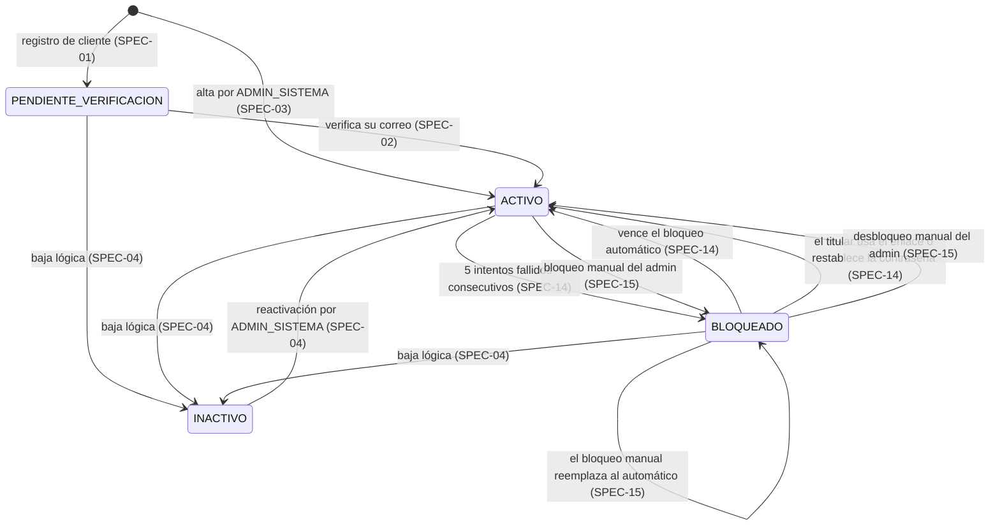

# Estados de una cuenta y sus transiciones

| Campo | Valor |
|---|---|
| **Dueño** | Product Owner, con Jose Luis (arquitectura de implementación) |
| **Afecta a** | SPEC-01 a SPEC-05, SPEC-07, SPEC-08, SPEC-12, SPEC-14, SPEC-15 |
| **Refleja** | El enum `EstadoCuenta` de `specs/openapi.yaml` |

Los cuatro estados de una cuenta están repartidos entre varias specs: SPEC-01
crea `PENDIENTE_VERIFICACION`, SPEC-02 la pasa a `ACTIVO`, SPEC-14 y SPEC-15
ponen `BLOQUEADO` y SPEC-04 pone `INACTIVO`, pero ninguna dice qué transiciones
son legales. Preguntas como
«¿se puede bloquear una cuenta ya desactivada?» no tenían respuesta escrita, y
tres personas distintas iban a implementarlas.

Este documento las fija.

---

## Los cuatro estados

| Estado | Qué significa | ¿Puede iniciar sesión? |
|---|---|---|
| `PENDIENTE_VERIFICACION` | Se registró pero no ha confirmado su correo | **No** |
| `ACTIVO` | Operativo | Sí |
| `BLOQUEADO` | Suspendido por fallos repetidos o por decisión de un administrador | **No** |
| `INACTIVO` | Dado de baja lógicamente. No se borra de la base de datos | **No** |

En los tres estados que impiden iniciar sesión, el login responde **exactamente
lo mismo que ante una contraseña incorrecta**: `401 CREDENCIALES_INVALIDAS`. Si
respondiera algo distinto, serviría para averiguar si la contraseña es correcta
o si la cuenta existe. Ver `specs/catalogo-errores.md`.

---

## Diagrama



---

## Tabla de transiciones

| Desde | Hasta | Quién la dispara | Spec | Efectos colaterales |
|---|---|---|---|---|
| — | `PENDIENTE_VERIFICACION` | El propio cliente al registrarse | 01 | Se envía el correo de verificación, token válido 24 h |
| — | `ACTIVO` | `ADMIN_SISTEMA` al dar de alta a un vendedor o admin | 03 | Publica `usuario.creado` |
| `PENDIENTE_VERIFICACION` | `ACTIVO` | El usuario, al consumir el enlace | 02 | Publica `usuario.creado` |
| `PENDIENTE_VERIFICACION` | `INACTIVO` | `ADMIN_SISTEMA` | 04 | Publica `usuario.desactivado` |
| `ACTIVO` | `BLOQUEADO` | El sistema, tras 5 intentos fallidos consecutivos | 14 | `bloqueado_hasta` = ahora + 1, 2 o 4 min según sea el 1.º, 2.º o 3.º bloqueo seguido; **desde el 4.º, `null`** · **no** cierra sesiones · correo con enlace de desbloqueo · `usuario.bloqueado` |
| `ACTIVO` | `BLOQUEADO` | `ADMIN_SISTEMA`, con motivo; nunca sobre sí mismo ni sobre el último `ADMIN_SISTEMA` activo | 15 | `bloqueado_hasta` = `null` · **cierra todas sus sesiones** · correo sin enlace · `usuario.bloqueado` |
| `ACTIVO` | `INACTIVO` | `ADMIN_SISTEMA`; nunca sobre sí mismo ni sobre el último `ADMIN_SISTEMA` activo | 04 | **Revoca todos sus tokens de refresco** · `usuario.desactivado` |
| `BLOQUEADO` | `ACTIVO` | Nadie: vence `bloqueado_hasta` | 14 | El estado se **calcula**, no lo cambia ningún proceso · contador a cero · **sin evento**: los módulos ya conocen `hasta` |
| `BLOQUEADO` | `ACTIVO` | El titular, con el enlace de desbloqueo o restableciendo la contraseña. Solo si el bloqueo es automático | 14, 08 | Contador a cero · `usuario.desbloqueado` |
| `BLOQUEADO` | `ACTIVO` | `ADMIN_SISTEMA` | 15 | Contador a cero · `usuario.desbloqueado` |
| `BLOQUEADO` | `BLOQUEADO` | `ADMIN_SISTEMA` sobre un bloqueo automático | 15 | El manual reemplaza al automático: `bloqueado_hasta` pasa a `null` |
| `BLOQUEADO` | `INACTIVO` | `ADMIN_SISTEMA` | 04 | Revoca sus tokens · `usuario.desactivado` |
| `INACTIVO` | `ACTIVO` | `ADMIN_SISTEMA`, con `POST /usuarios/{id}/reactivar` | 04 | Conserva identidad, correo y roles · sin sesiones · sin repetir la verificación · `usuario.reactivado` |

---

## Transiciones que NO existen

Escritas a propósito, porque son las que alguien va a implementar por
interpretación si no están prohibidas aquí.

| Transición | Por qué no |
|---|---|
| `INACTIVO` → `BLOQUEADO` | Bloquear a quien ya no puede entrar no aporta nada. El admin que quiera «reforzar» una baja no tiene nada que reforzar |
| `INACTIVO` → `PENDIENTE_VERIFICACION` | Una reactivación no vuelve a pedir verificación: el correo ya se verificó una vez |
| `PENDIENTE_VERIFICACION` → `BLOQUEADO` | Solo cuentan los intentos fallidos sobre cuentas `ACTIVO`: una cuenta que todavía no puede iniciar sesión no tiene nada que proteger |
| `BLOQUEADO` → `PENDIENTE_VERIFICACION` | El bloqueo no revierte la verificación |
| Cualquier transición disparada por un módulo consumidor | Los seis módulos **leen** estado, nunca lo cambian. No existe endpoint que se lo permita |

---

## Reglas que cruzan estados

**El contador de intentos fallidos vive fuera del estado.** Un usuario `ACTIVO`
puede tener 4 fallos acumulados y seguir `ACTIVO`. Cuenta fallos consecutivos,
sin ventana de tiempo, y vuelve a cero con un login correcto, con cualquier
desbloqueo, al restablecer la contraseña y al vencer un bloqueo. Aparte se
cuentan los **bloqueos seguidos**, que solo vuelven a cero con un login
correcto. Todo esto es de SPEC-14; aquí se anota porque explica por qué
`ACTIVO` no se subdivide.

**La caducidad de contraseña no es un estado.** Quien tiene un rol de gestión y
la contraseña vencida sigue `ACTIVO`; lo que ocurre es que, al completar la
autenticación, recibe `403 PASSWORD_CADUCADA` en vez de tokens, y la restablece
con el flujo de recuperación (SPEC-08). La regla es de SPEC-07. Si fuese
un estado, habría que decidir qué pasa si además se bloquea, y no hace falta.

**El segundo factor tampoco es un estado.** `mfa_habilitado` es una bandera
independiente. Una cuenta con MFA activo sigue `ACTIVO`; lo que cambia es que el
inicio de sesión devuelve un desafío en vez de tokens. Es de SPEC-09.

**Toda transición se audita.** Las seis acciones correspondientes están en el
catálogo de `SPEC-12`, y las marcadas como críticas revierten la transición si
no se pudo auditar.

---

## Dónde vive esto en el código

El enum está publicado en el contrato:

```yaml
EstadoCuenta:
  type: string
  enum: [ACTIVO, INACTIVO, BLOQUEADO, PENDIENTE_VERIFICACION]
```

Los seis módulos consumidores lo reciben en `GET /usuarios/{id}`. **Añadir un
estado nuevo es un cambio incompatible**: un consumidor que reciba un valor que
no conoce no sabrá si permitir la operación. Si alguna spec necesita un estado
más, se discute con el PO antes de implementarlo.
