# Modelo de Datos - Sistema de Identidad, Autenticación y Autorización (IAM)

## 1. Visión General y Principios de Diseño
El modelo de datos del sistema IAM está diseñado sobre **PostgreSQL 15+** para dar soporte a una arquitectura empresarial de Identidad, Autenticación, Autorización OIDC/OAuth2, Seguridad y Auditoría.

### Principios del Modelo:
* **Identificadores Únicos Universales (`UUID`):** Todas las entidades principales utilizan claves primarias tipo `UUID` (generadas mediante `gen_random_uuid()`) para prevenir enumeración de IDs, facilitar arquitecturas distribuidas y desacoplar entornos de prueba.
* **Auditoría Nativa e Inmutabilidad:** Trazabilidad nativa con marcas temporales (`creado_en`, `actualizado_en`) gestionadas automáticamente vía triggers PL/pgSQL (`fn_actualizar_timestamp`). La tabla de auditoría es estrictamente incremental y append-only.
* **Estrategia de Versionado Flyway:** Organización modular en scripts de migración de esquemas (`V1` a `V4`) y script de datos semilla (`V100`).

---

## 2. Tipos Enumerados (Enums)

| Nombre de Enum | Valores Posibles | Propósito / Descripción |
| :--- | :--- | :--- |
| `enum_tipo_documento` | `'DNI'`, `'CE'`, `'PASAPORTE'`, `'RUC'` | Tipos de documentos de identidad válidos para el registro de usuarios. |
| `enum_estado_usuario` | `'PENDIENTE_ACTIVACION'`, `'ACTIVO'`, `'INACTIVO'`, `'BLOQUEADO'`, `'SUSPENDIDO'` | Ciclo de vida operacional de la cuenta de usuario. |
| `enum_tipo_usuario` | `'CLIENTE'`, `'EMPLEADO'`, `'SISTEMA'` | Clasificación de tipo de actor en la plataforma. |
| `enum_proposito_otp` | `'ACTIVACION_CUENTA'`, `'MFA_LOGIN'`, `'RECUPERACION_PASSWORD'`, `'CAMBIO_EMAIL'` | Contexto de uso de un código One-Time Password. |
| `enum_tipo_token_un_uso` | `'ACTIVACION_CUENTA'`, `'RESET_PASSWORD'`, `'CAMBIO_EMAIL'` | Tipo de flujo respaldado por tokens hash de un solo uso. |
| `enum_canal_mfa` | `'EMAIL'`, `'SMS'`, `'TOTP'` | Canal de comunicación para la autenticación multifactor. |
| `enum_estado_mfa` | `'PENDIENTE'`, `'VERIFICADO'`, `'EXPIRADO'`, `'FALLIDO'` | Estado del desafío MFA generado. |
| `enum_tipo_bloqueo` | `'TEMPORAL'`, `'PERMANENTE'` | Severidad y naturaleza del bloqueo sobre un usuario. |

---

## 3. Diagrama Entidad-Relación (ERD)

```mermaid
erDiagram
    %% MÓDULO V1: USUARIO Y PERFIL
    usuario ||--o| perfiles : "1:1 (Perfil Demográfico)"
    usuario ||--o{ direccion : "1:N (Direcciones)"
    usuario ||--o{ usuario_rol : "1:N (Asignación Roles)"
    rol ||--o{ usuario_rol : "1:N"
    rol ||--o{ rol_permiso : "1:N (Asignación Permisos)"
    permiso ||--o{ rol_permiso : "1:N"

    %% MÓDULO V2: AUTENTICACIÓN Y SEGURIDAD
    usuario ||--o{ credencial : "1:N (Histórico de Credenciales)"
    usuario ||--o{ password_historial : "1:N (Prevención Reuso)"
    usuario ||--o{ otp : "1:N (Códigos OTP)"
    usuario ||--o{ token_un_uso : "1:N (Tokens Acción Única)"

    %% MÓDULO V3: SESIONES Y BLOQUEOS
    usuario ||--o{ token_refresco : "1:N (Sesiones Activas)"
    usuario ||--o{ desafio_mfa : "1:N (Desafíos 2FA)"
    usuario ||--o{ intento_login : "0:N (Pista de Accesos)"
    usuario ||--o| bloqueo : "0:1 (Registro Bloqueo)"

    %% MÓDULO V4: AUDITORÍA Y OIDC/OAUTH2
    usuario ||--o{ auditoria_seguridad : "0:N (Eventos de Auditoría)"
    cliente_servicio ||--o{ cliente_servicio_scope : "1:N"
    scope ||--o{ cliente_servicio_scope : "1:N"
    auditoria_seguridad ||--o| outbox : "0:1 (Publicación Asíncrona)"
```



---

## 4. Diccionario Completo de Tablas por Migración (Flyway)

### Migración V1: Identidades, Perfiles, Ubicación y RBAC Base

#### 1. Tabla `usuario`
Entidad principal de identidad y cuenta.
* `id` (`UUID`, PK, Default: `gen_random_uuid()`): Identificador único global del usuario.
* `tipo_documento` (`enum_tipo_documento`, NOT NULL): Tipo de documento legal de identidad.
* `numero_documento` (`VARCHAR(20)`, UNIQUE, NOT NULL): Número de documento de identidad.
* `email` (`VARCHAR(255)`, UNIQUE, NOT NULL): Correo electrónico principal (Username OIDC).
* `email_verificado` (`BOOLEAN`, Default: `FALSE`): Flag de verificación de propiedad de email.
* `estado` (`enum_estado_usuario`, Default: `'PENDIENTE_ACTIVACION'`): Estado actual del usuario.
* `tipo_usuario` (`enum_tipo_usuario`, Default: `'CLIENTE'`): Tipo de cuenta asignada.
* `requiere_cambio_password` (`BOOLEAN`, Default: `TRUE`): Obliga al usuario a cambiar contraseña en primer ingreso.
* `creado_en` (`TIMESTAMPTZ`, Default: `NOW()`): Fecha y hora de creación de la cuenta.
* `actualizado_en` (`TIMESTAMPTZ`, Default: `NOW()`): Fecha y hora de última actualización.

#### 2. Tabla `perfiles`
Información personal y demográfica (Relación 1:1 estricta con `usuario`).
* `usuario_id` (`UUID`, PK, FK -> `usuario.id` ON DELETE CASCADE): Referencia al usuario titular.
* `nombres` (`VARCHAR(100)`, NOT NULL): Nombres del usuario.
* `apellido_paterno` (`VARCHAR(100)`, NOT NULL): Primer apellido.
* `apellido_materno` (`VARCHAR(100)`): Segundo apellido (opcional).
* `telefono` (`VARCHAR(20)`): Número telefónico móvil o fijo.
* `telefono_verificado` (`BOOLEAN`, Default: `FALSE`): Flag de verificación SMS/MFA del teléfono.
* `fecha_nacimiento` (`DATE`): Fecha de nacimiento para validaciones de edad.
* `genero` (`VARCHAR(20)`): Género expresado por el usuario.
* `preferencias_notificacion` (`JSONB`, Default: `'{}'`): Configuración en JSON de canal e idioma predeterminado.
* `actualizado_en` (`TIMESTAMPTZ`, Default: `NOW()`): Última actualización de datos personales.

#### 3. Tabla `direccion`
Libro de direcciones del usuario (Relación 1:N).
* `id` (`UUID`, PK, Default: `gen_random_uuid()`): Identificador único de la dirección.
* `usuario_id` (`UUID`, FK -> `usuario.id` ON DELETE CASCADE): Propietario de la dirección.
* `tipo_direccion` (`VARCHAR(30)`): Tipo ('DOMICILIARIA', 'ENVIO', 'FACTURACION').
* `departamento` (`VARCHAR(100)`): Ubicación geográfica (Nivel 1).
* `provincia` (`VARCHAR(100)`): Ubicación geográfica (Nivel 2).
* `distrito` (`VARCHAR(100)`): Ubicación geográfica (Nivel 3).
* `ubigeo` (`VARCHAR(6)`): Código oficial de ubigeo (Perú).
* `direccion_linea1` (`VARCHAR(255)`, NOT NULL): Vía, número, manzana, lote, dpto.
* `direccion_linea2` (`VARCHAR(255)`): Referencias adicionales de ubicación.
* `codigo_postal` (`VARCHAR(10)`): Código postal de zona.
* `es_principal` (`BOOLEAN`, Default: `FALSE`): Indica si es la dirección predeterminada.
* `creado_en` (`TIMESTAMPTZ`, Default: `NOW()`).
* `actualizado_en` (`TIMESTAMPTZ`, Default: `NOW()`).

#### 4. Tabla `rol`
Catálogo de roles del sistema (RBAC).
* `id` (`BIGSERIAL`, PK): Identificador numérico del rol.
* `codigo` (`VARCHAR(50)`, UNIQUE, NOT NULL): Identificador único en texto (e.g. 'ADMIN_SISTEMA').
* `nombre` (`VARCHAR(100)`, NOT NULL): Nombre descriptivo para la UI.
* `descripcion` (`TEXT`): Explicación del alcance de los accesos.
* `es_sistema` (`BOOLEAN`, Default: `FALSE`): Invariable si es un rol núcleo del sistema.
* `creado_en` (`TIMESTAMPTZ`, Default: `NOW()`).

#### 5. Tabla `permiso`
Catálogo de permisos de funcionalidad/API.
* `id` (`BIGSERIAL`, PK): Identificador numérico del permiso.
* `codigo` (`VARCHAR(100)`, UNIQUE, NOT NULL): Clave de permiso (e.g. 'USUARIO_CREAR', 'ROL_ASIGNAR').
* `modulo` (`VARCHAR(50)`, NOT NULL): Módulo del sistema al que pertenece el permiso.
* `descripcion` (`TEXT`): Descripción funcional de la operación permitida.
* `creado_en` (`TIMESTAMPTZ`, Default: `NOW()`).

#### 6. Tabla `usuario_rol`
Relación N:M entre `usuario` y `rol`.
* `usuario_id` (`UUID`, FK -> `usuario.id` ON DELETE CASCADE).
* `rol_id` (`BIGINT`, FK -> `rol.id` ON DELETE CASCADE).
* `asigned_en` (`TIMESTAMPTZ`, Default: `NOW()`): Registro de auditoría de cuándo se otorgó el rol.
* **PK:** (`usuario_id`, `rol_id`).

#### 7. Tabla `rol_permiso`
Relación N:M entre `rol` y `permiso`.
* `rol_id` (`BIGINT`, FK -> `rol.id` ON DELETE CASCADE).
* `permiso_id` (`BIGINT`, FK -> `permiso.id` ON DELETE CASCADE).
* **PK:** (`rol_id`, `permiso_id`).

---

### Migración V2: Credenciales, Historial, OTP y Tokens de Un Solo Uso

#### 8. Tabla `credencial`
Credenciales de acceso autenticables del usuario.
* `id` (`UUID`, PK, Default: `gen_random_uuid()`).
* `usuario_id` (`UUID`, FK -> `usuario.id` ON DELETE CASCADE).
* `password_hash` (`VARCHAR(255)`, NOT NULL): Hash seguro de la contraseña (Argon2id).
* `algoritmo` (`VARCHAR(30)`, Default: `'ARGON2ID'`): Algoritmo criptográfico utilizado.
* `es_vigente` (`BOOLEAN`, Default: `TRUE`): Define si es la credencial activa actualmente.
* `fecha_expiracion` (`TIMESTAMPTZ`): Fecha en que vencerá la credencial por políticas de seguridad.
* `creado_en` (`TIMESTAMPTZ`, Default: `NOW()`).

#### 9. Tabla `password_historial`
Prevención de reutilización de las últimas N contraseñas.
* `id` (`UUID`, PK, Default: `gen_random_uuid()`).
* `usuario_id` (`UUID`, FK -> `usuario.id` ON DELETE CASCADE).
* `password_hash` (`VARCHAR(255)`, NOT NULL): Hash histórico de la clave antigua.
* `creado_en` (`TIMESTAMPTZ`, Default: `NOW()`).

#### 10. Tabla `otp`
Gestión de códigos temporales (One-Time Password).
* `id` (`UUID`, PK, Default: `gen_random_uuid()`).
* `usuario_id` (`UUID`, FK -> `usuario.id` ON DELETE CASCADE).
* `codigo_hash` (`VARCHAR(255)`, NOT NULL): Hash del código numérico generado.
* `proposito` (`enum_proposito_otp`, NOT NULL): Motivo del envío del OTP.
* `intentos_fallidos` (`INT`, Default: 0): Contador de fallos de validación.
* `expira_en` (`TIMESTAMPTZ`, NOT NULL): Momento exacto de expiración (e.g. +5 min).
* `usado` (`BOOLEAN`, Default: `FALSE`): Flag de un solo uso consumido.
* `creado_en` (`TIMESTAMPTZ`, Default: `NOW()`).

#### 11. Tabla `token_un_uso`
Tokens seguros tipo URL para verificación por correo electrónico y reseteo de clave.
* `id` (`UUID`, PK, Default: `gen_random_uuid()`).
* `usuario_id` (`UUID`, FK -> `usuario.id` ON DELETE CASCADE).
* `token_hash` (`VARCHAR(255)`, UNIQUE, NOT NULL): Hash SHA-256 del token enviado al usuario.
* `tipo` (`enum_tipo_token_un_uso`, NOT NULL): Propósito del enlace.
* `expira_en` (`TIMESTAMPTZ`, NOT NULL): Vencimiento del enlace (e.g. +24 Horas).
* `consumido_en` (`TIMESTAMPTZ`): Timestamp de cuando el token fue utilizado exitosamente.
* `creado_en` (`TIMESTAMPTZ`, Default: `NOW()`).

---

### Migración V3: Sesiones, MFA, Control de Accesos y Bloqueos

#### 12. Tabla `token_refresco`
Persistencia de sesiones activas OIDC/OAuth2 (Refresh Tokens).
* `id` (`UUID`, PK, Default: `gen_random_uuid()`).
* `usuario_id` (`UUID`, FK -> `usuario.id` ON DELETE CASCADE).
* `token_hash` (`VARCHAR(255)`, UNIQUE, NOT NULL): Hash seguro del Refresh Token emitido.
* `familia_id` (`UUID`, NOT NULL): ID para la rotación y detección de rehuso de tokens.
* `ip_origen` (`VARCHAR(45)`): Dirección IPv4/IPv6 de la sesión.
* `user_agent` (`TEXT`): Dispositivo y navegador utilizado.
* `revocado` (`BOOLEAN`, Default: `FALSE`): Marcador de sesión cerrada/invalidada.
* `expira_en` (`TIMESTAMPTZ`, NOT NULL): Tiempo de vida del Refresh Token.
* `creado_en` (`TIMESTAMPTZ`, Default: `NOW()`).

#### 13. Tabla `desafio_mfa`
Instancias y desafíos de verificación multifactorial activos.
* `id` (`UUID`, PK, Default: `gen_random_uuid()`).
* `usuario_id` (`UUID`, FK -> `usuario.id` ON DELETE CASCADE).
* `canal` (`enum_canal_mfa`, NOT NULL): Canal configurado ('EMAIL', 'SMS', 'TOTP').
* `estado` (`enum_estado_mfa`, Default: `'PENDIENTE'`): Estado de la verificación.
* `intentos` (`INT`, Default: 0): Intentos procesados en el desafío.
* `expira_en` (`TIMESTAMPTZ`, NOT NULL).
* `creado_en` (`TIMESTAMPTZ`, Default: `NOW()`).

#### 14. Tabla `intento_login`
Registro cronológico de intentos de inicio de sesión para analítica de ataques y auto-bloqueo.
* `id` (`UUID`, PK, Default: `gen_random_uuid()`).
* `email_ingresado` (`VARCHAR(255)`, NOT NULL): Email escrito en el formulario.
* `usuario_id` (`UUID`, FK -> `usuario.id` ON DELETE SET NULL): Nulo si el email no existía.
* `exitoso` (`BOOLEAN`, NOT NULL): Resultado del intento de autenticación.
* `ip_origen` (`VARCHAR(45)`, NOT NULL): Dirección IP desde donde vino la petición.
* `motivo_fallo` (`VARCHAR(100)`): Causa del error (e.g. 'PASSWORD_INCORRECTO', 'USUARIO_BLOQUEADO').
* `creado_en` (`TIMESTAMPTZ`, Default: `NOW()`).

#### 15. Tabla `bloqueo`
Estado de inhabilitación operativa del usuario.
* `id` (`UUID`, PK, Default: `gen_random_uuid()`).
* `usuario_id` (`UUID`, FK -> `usuario.id` ON DELETE CASCADE, UNIQUE): Un único registro activo por usuario.
* `tipo_bloqueo` (`enum_tipo_bloqueo`, NOT NULL): 'TEMPORAL' o 'PERMANENTE'.
* `motivo` (`TEXT`, NOT NULL): Causa explícita del bloqueo (e.g. 'EXCESO_INTENTOS_FALLIDOS').
* `expira_en` (`TIMESTAMPTZ`): Nulo si el tipo de bloqueo es permanente.
* `creado_en` (`TIMESTAMPTZ`, Default: `NOW()`).

#### 16. Vista `usuario_estado_efectivo`
Vista calculada dinámicamente para determinar el estado real del usuario evaluando la tabla `bloqueo` y los vencimientos de tiempo:

```sql
CREATE OR REPLACE VIEW usuario_estado_efectivo AS
SELECT 
    u.id AS usuario_id,
    u.email,
    CASE 
        WHEN b.id IS NOT NULL AND (b.expira_en IS NULL OR b.expira_en > NOW()) THEN 'BLOQUEADO'::enum_estado_usuario
        ELSE u.estado
    END AS estado_efectivo,
    b.motivo AS motivo_bloqueo,
    b.expira_en AS bloqueo_expira_en
FROM usuario u
LEFT JOIN bloqueo b ON u.id = b.usuario_id;
```

---

### Migración V4: Auditoría Inmutable, Clientes OIDC y Transactional Outbox Pattern

#### 17. Tabla `auditoria_seguridad`
Registro inmutable de auditoría para el cumplimiento de estándares normativos.
* `id` (`UUID`, PK, Default: `gen_random_uuid()`).
* `usuario_id` (`UUID`, FK -> `usuario.id` ON DELETE SET NULL): Usuario que gatilló el evento.
* `evento` (`VARCHAR(100)`, NOT NULL): Identificador de evento (e.g., 'LOGIN_EXITOSO', 'CAMBIO_PASSWORD', 'ROLES_ACTUALIZADOS').
* `resultado` (`VARCHAR(20)`, NOT NULL): 'EXITO' o 'FRACASO'.
* `ip_origen` (`VARCHAR(45)`): Dirección IP asociada a la solicitud.
* `detalles` (`JSONB`, Default: `'{}'`): Metadatos adicionales estructurados.
* `creado_en` (`TIMESTAMPTZ`, Default: `NOW()`).

#### 18. Tabla `cliente_servicio`
Clientes OIDC y aplicaciones consumidoras autorizadas.
* `id` (`UUID`, PK, Default: `gen_random_uuid()`).
* `cliente_id` (`VARCHAR(100)`, UNIQUE, NOT NULL): Client ID OIDC.
* `cliente_secreto_hash` (`VARCHAR(255)`): Secret hash para clientes confidenciales.
* `nombre_servicio` (`VARCHAR(100)`, NOT NULL): Nombre del sistema/aplicación conectada.
* `es_confidencial` (`BOOLEAN`, Default: `TRUE`): Flag si la app puede guardar secretos de manera segura.
* `activo` (`BOOLEAN`, Default: `TRUE`).
* `creado_en` (`TIMESTAMPTZ`, Default: `NOW()`).

#### 19. Tabla `scope`
Catálogo de scopes OIDC de acceso.
* `id` (`BIGSERIAL`, PK).
* `nombre` (`VARCHAR(50)`, UNIQUE, NOT NULL): Nombre estándar OIDC (e.g. 'openid', 'profile', 'email').
* `descripcion` (`TEXT`).

#### 20. Tabla `cliente_servicio_scope`
Relación N:M de asignación de scopes permitidos por cliente OIDC.
* `cliente_servicio_id` (`UUID`, FK -> `cliente_servicio.id` ON DELETE CASCADE).
* `scope_id` (`BIGINT`, FK -> `scope.id` ON DELETE CASCADE).
* **PK:** (`cliente_servicio_id`, `scope_id`).

#### 21. Tabla `outbox`
Patrón Transactional Outbox para publicación confiable y asíncrona de eventos de dominio a RabbitMQ/Kafka.
* `id` (`UUID`, PK, Default: `gen_random_uuid()`).
* `agregado_tipo` (`VARCHAR(50)`, NOT NULL): Tipo de dominio (e.g., 'USUARIO', 'AUTENTICACION').
* `agregado_id` (`VARCHAR(100)`, NOT NULL): ID del agregado transaccionado.
* `tipo_evento` (`VARCHAR(100)`, NOT NULL): Evento emitido (e.g., 'USUARIO_CREADO').
* `payload` (`JSONB`, NOT NULL): Cuerpo del mensaje completo en formato JSON.
* `procesado` (`BOOLEAN`, Default: `FALSE`): Flag de consumo del worker asíncrono.
* `creado_en` (`TIMESTAMPTZ`, Default: `NOW()`).
* `procesado_en` (`TIMESTAMPTZ`): Marca de tiempo cuando se confirmó la publicación al broker.

---

## 5. Triggers e Índices de Optimización de Rendimiento

### 1. Trigger Automático de Timestamp (`fn_actualizar_timestamp`)
Automáticamente actualiza el campo `actualizado_en` antes de ejecutar una sentencia `UPDATE` en las tablas `usuario`, `perfiles` y `direccion`:

```sql
CREATE OR REPLACE FUNCTION fn_actualizar_timestamp()
RETURNS TRIGGER AS $$
BEGIN
    NEW.actualizado_en = NOW();
    RETURN NEW;
END;
$$ LANGUAGE plpgsql;
```

### 2. Índices de Alto Rendimiento
* **`idx_usuario_email`:** B-Tree sobre `usuario(email)` para búsquedas inmediatas en login OIDC.
* **`idx_usuario_numero_doc`:** B-Tree sobre `usuario(numero_documento)` para validaciones de duplicidad de identidades.
* **`idx_token_refresco_hash`:** Hash / B-Tree sobre `token_refresco(token_hash)` para validaciones de Refresh Token en milisegundos.
* **`idx_intento_login_email_fecha`:** B-Tree compuesto sobre `intento_login(email_ingresado, creado_en)` para cómputo rápido de bloqueos por reintentos.
* **`idx_auditoria_usuario_fecha`:** B-Tree compuesto sobre `auditoria_seguridad(usuario_id, creado_en)` para reportes y pistas de auditoría.
* **`idx_outbox_procesado`:** Partial Index B-Tree sobre `outbox(procesado, creado_en) WHERE procesado = FALSE` para un barrido ultrarrápido por parte del worker de mensajería.

---

## 6. Migración V100: Datos Semilla (Catálogos Semilla)

Ubicación del script: `src/main/resources/db/migration/V100__datos_semilla.sql`.

### 1. Inserción de los 6 Roles del Sistema:

```sql
INSERT INTO rol (codigo, nombre, descripcion, es_sistema) VALUES
('CLIENTE', 'Cliente Final', 'Usuario comprador de la plataforma', TRUE),
('VENDEDOR', 'Asesor de Ventas', 'Gestión de cotizaciones y pedidos', TRUE),
('ADMIN_VENTAS', 'Supervisor de Ventas', 'Supervisión de operaciones comerciales', TRUE),
('GESTOR_DESPACHO', 'Gestor de Logística', 'Administración de almacén y despachos', TRUE),
('GESTOR_COMERCIAL', 'Gestor Comercial', 'Gestión de catálogo de productos y precios', TRUE),
('ADMIN_SISTEMA', 'Administrador del Sistema', 'Superadministrador de la plataforma e IAM', TRUE);
```

### 2. Inserción de Scopes OIDC Iniciales:

```sql
INSERT INTO scope (nombre, descripcion) VALUES
('openid', 'Permite la autenticación basada en OpenID Connect'),
('profile', 'Acceso a la información del perfil del usuario (nombres, foto, etc.)'),
('email', 'Acceso a la dirección de correo electrónico del usuario'),
('phone', 'Acceso al número telefónico del usuario'),
('address', 'Acceso a las direcciones registradas del usuario');
```

---

## 7. Matriz Completa de Trazabilidad (Especificaciones vs Tablas)

| ID | Especificación / Flujo Funcional | Tablas Mapeadas de Soporte |
| :---: | :--- | :--- |
| **01** | Registro de Usuario y Verificación Inicial | `usuario`, `perfiles`, `direccion`, `token_un_uso` |
| **02** | Autenticación de Usuarios (Login / Clave) | `usuario`, `credencial`, `intento_login` |
| **03** | Gestión de Código OTP / MFA | `otp`, `desafio_mfa`, `perfiles` |
| **04** | Emisión y Rotación de Tokens OIDC / Sesiones | `token_refresco`, `cliente_servicio`, `scope`, `cliente_servicio_scope` |
| **05** | Gestión y Autorización por Roles y Permisos (RBAC) | `rol`, `permiso`, `usuario_rol`, `rol_permiso` |
| **06** | Control de Intentos Fallidos y Bloqueo de Cuentas | `intento_login`, `bloqueo`, `usuario_estado_efectivo` (Vista) |
| **07** | Recuperación y Reseteo de Contraseña | `token_un_uso`, `credencial`, `password_historial` |
| **08** | Auditoría Inmutable de Seguridad y Eventos Domain-Driven | `auditoria_seguridad`, `outbox` |