# Modelo de Datos — Módulo de Seguridad y Autenticación (G7)

> **Fuente de verdad:** `docs/arquitectura/schema.sql` (auditoría 29-sep). Este documento describe el esquema físico actual, sus decisiones de diseño y la trazabilidad con las especificaciones. El diagrama DBML correspondiente está en `schema.dbml`.

---

## 1. Visión General y Principios de Diseño

El modelo de datos soporta el **proveedor de identidad** del Marketplace Multicanal de Productos Deportivos. Principios:

- **Identificadores universales (UUID):** Todas las entidades principales usan `uuid` con `gen_random_uuid()` para prevenir enumeración y facilitar entornos distribuidos.
- **Enums nativos PostgreSQL:** 11 tipos `ENUM` definidos en BD; Hibernate mapea con `@Enumerated(EnumType.STRING)` + `@JdbcTypeCode(SqlTypes.NAMED_ENUM)` (Spring Boot 3.1+, Hibernate 6.2+).
- **Estado de cuenta dual:**
  - `usuario.estado` (`estado_cuenta`): **ciclo de vida persistido** — `ACTIVO`, `INACTIVO`, `PENDIENTE_VERIFICACION`. **No incluye `BLOQUEADO`.**
  - `usuario_estado_efectivo` (vista): **estado expuesto a la API** — añade `BLOQUEADO` calculado desde la tabla `bloqueo` (RF-14.7, RF-15.5).
- **Auditoría solo-anexo (append-only):** `auditoria_seguridad` tiene trigger que impide `UPDATE`; el usuario de BD de la app no tiene `UPDATE` ni `DELETE` (la purga la hace otro usuario). Los `GRANT` van en despliegue.
- **FK compuesta crítica:** `otp(desafio_id, usuario_id)` → `desafio_mfa(id, usuario_id)` con `MATCH SIMPLE` (si `desafio_id` es `NULL` no se evalúa; ESC-09.9).
- **Tokens solo por hash:** `token_refresco`, `desafio_mfa`, `token_un_uso` guardan `hash_token` `UNIQUE`; se buscan por hash, nunca en claro.
- **Índices funcionales y parciales:** `LOWER(correo)` para unicidad case-insensitive; `direccion.es_predeterminada` único parcial por usuario.
- **Cifrado de documento:** `perfil_cliente.documento_cifrado` (AES, clave fuera de BD) + `documento_key_id` para rotación sin re-cifrar. CHECK obliga a que los tres campos vayan juntos o los tres `NULL`.
- **Límites sin enumerar cuentas:** `solicitud_limitada` guarda `HMAC-SHA256(correo_normalizado)` con clave de servidor, no el correo (Ley 29733). Se purga pasada la ventana de 1 hora.
- **Convención de nombres:** Permisos = `recurso.accion` (punto); Scopes = `recurso:accion` (dos puntos). Nunca se confunden.

---

## 2. Enums (11)

| Enum | Valores | Propósito |
|---|---|---|
| `estado_cuenta` | `ACTIVO`, `INACTIVO`, `PENDIENTE_VERIFICACION` | Ciclo de vida persistido de la cuenta (sin `BLOQUEADO`). |
| `codigo_rol` | `CLIENTE`, `VENDEDOR`, `ADMIN_VENTAS`, `GESTOR_DESPACHO`, `GESTOR_COMERCIAL`, `ADMIN_SISTEMA` | Catálogo cerrado de 6 roles (SPEC-11). |
| `tipo_documento` | `DNI`, `CE`, `PASAPORTE` | Tipos de documento de identidad (SPEC-16). |
| `canal_origen` | `WEB`, `CHATBOT`, `RETAIL`, `MARKETPLACE` | Canal por el que se registró el usuario (SPEC-01, RF-01.7). |
| `canal_otp` | `EMAIL`, `SMS` | Canal de envío del código OTP (SPEC-09/10). |
| `tipo_bloqueo` | `AUTOMATICO`, `MANUAL` | Naturaleza del bloqueo (SPEC-14/15). |
| `resultado` | `EXITO`, `FALLO` | Resultado de intentos de login y auditoría. |
| `actor_tipo` | `USUARIO`, `MODULO`, `SISTEMA` | Tipo de actor en `auditoria_seguridad` y `outbox`. |
| `proposito_token` | `VERIFICAR_CORREO`, `CAMBIO_CORREO`, `RECUPERACION`, `DESBLOQUEO` | Propósito de `token_un_uso` (SPEC-02/08/14/16). |
| `estado_cuenta_efectivo` | `ACTIVO`, `INACTIVO`, `BLOQUEADO`, `PENDIENTE_VERIFICACION` | Estado que ven la API y los módulos (vista `usuario_estado_efectivo`). |
| `tipo_limite` | `REENVIO_VERIFICACION`, `RECUPERACION` | Tipo de límite en `solicitud_limitada` (RF-02.4, RF-08.8). |

---

## 3. Diagrama Entidad-Relación (ERD)

```mermaid
erDiagram
    %% V1: USUARIO Y PERFILES
    usuario ||--|| perfil_cliente : "1:1"
    usuario ||--|| perfil_vendedor : "1:1"
    usuario ||--o{ direccion : "1:N"
    usuario }|--o{ usuario_rol : "N:M"
    rol ||--o{ usuario_rol : "N:M"
    rol ||--o{ rol_permiso : "N:M"
    permiso ||--o{ rol_permiso : "N:M"

    %% V2: CREDENCIALES Y TOKENS UN SOLO USO
    usuario ||--|| credencial : "1:1"
    usuario ||--o{ password_historial : "1:N"
    usuario ||--o{ otp : "1:N"
    usuario ||--o{ token_un_uso : "1:N"
    usuario ||--o{ solicitud_limitada : "1:N (por HMAC correo)"

    %% V3: SESIONES, MFA, BLOQUEOS
    usuario ||--o{ token_refresco : "1:N"
    usuario ||--o{ desafio_mfa : "1:N"
    usuario ||--o{ intento_login : "0:N"
    usuario ||--o| bloqueo : "0:1"

    %% V4: AUDITORÍA, OIDC, OUTBOX
    usuario ||--o{ auditoria_seguridad : "0:N (sin FK)"
    cliente_servicio ||--o{ cliente_servicio_scope : "1:N"
    scope ||--o{ cliente_servicio_scope : "1:N"
    auditoria_seguridad ||--o| outbox : "0:1 (after-commit)"

    %% FK COMPUESTA
    desafio_mfa ||--o{ otp : "1:N (desafio_id, usuario_id)"
```



**Leyenda:**
- `||--||` = uno a uno obligatorio
- `||--o{` = uno a muchos
- `}|--o{` = muchos a muchos
- `||--o|` = uno a cero-uno

---

## 4. Diccionario Completo de Tablas por Migración (Flyway)

### Migración V1: Identidades, Perfiles, Direcciones y RBAC Base
*Archivo: `V1__usuario_y_roles.sql`*

#### 1. Tabla `usuario`
Entidad central (dueña SPEC-01). Un solo dueño de identidad en el marketplace.

| Columna | Tipo | Restricciones | Comentario |
|---|---|---|---|
| `id` | `uuid` | PK, `DEFAULT gen_random_uuid()` | Identificador único global |
| `correo` | `varchar(254)` | `NOT NULL`, `CHECK (correo = LOWER(correo))` | Normalizado a minúsculas |
| `nombres` | `varchar(100)` | `NOT NULL` | |
| `apellidos` | `varchar(100)` | `NOT NULL` | |
| `celular` | `varchar(12)` | `CHECK (celular ~ '^\\+51[0-9]{9}$')` | Formato +51 9 dígitos |
| `estado` | `estado_cuenta` | `NOT NULL` | Ciclo de vida (sin BLOQUEADO) |
| `correo_verificado` | `boolean` | `NOT NULL DEFAULT false` | |
| `celular_verificado` | `boolean` | `NOT NULL DEFAULT false` | |
| `mfa_habilitado` | `boolean` | `NOT NULL DEFAULT false` | |
| `acepta_terminos` | `boolean` | `NOT NULL DEFAULT false` | `true` en registro público (SPEC-01) |
| `fecha_aceptacion` | `timestamptz` | | Obligatorio si `acepta_terminos = true` |
| `version_terminos` | `varchar(20)` | | Versión del texto aceptado |
| `canal_origen` | `canal_origen` | `NOT NULL DEFAULT 'WEB'` | Canal de registro (SPEC-01) |
| `intentos_fallidos_consecutivos` | `integer` | `NOT NULL DEFAULT 0, CHECK (>=0)` | Fuente de verdad del contador (SPEC-14) |
| `bloqueos_seguidos` | `integer` | `NOT NULL DEFAULT 0, CHECK (>=0)` | Escalera 1/2/4/null (SPEC-14) |
| `creado_en` | `timestamptz` | `NOT NULL DEFAULT now()` | |
| `actualizado_en` | `timestamptz` | | Actualizado por trigger si aplica |

**Índices:** `uq_usuario_correo_lower` (`LOWER(correo)`) — unicidad case-insensitive.

#### 2. Tabla `perfil_cliente`
Atributos de `CLIENTE` (SPEC-16). Documento cifrado AES con clave fuera de BD.

| Columna | Tipo | Restricciones |
|---|---|---|
| `usuario_id` | `uuid` | PK, FK → `usuario.id` `ON DELETE CASCADE` |
| `tipo_documento` | `tipo_documento` | |
| `documento_cifrado` | `text` | AES; se expone enmascarado `*****234` |
| `fecha_nacimiento` | `date` | |
| `documento_key_id` | `varchar(50)` | `key_id` de la clave AES para rotación |

**CHECK `ck_perfil_cliente_documento`:** Los tres campos (`tipo_documento`, `documento_cifrado`, `documento_key_id`) son todos `NULL` o todos `NOT NULL`.

#### 3. Tabla `perfil_vendedor`
Atributos de `VENDEDOR` (SPEC-16). `tienda` es nombre, no FK (entidad en otro módulo).

| Columna | Tipo | Restricciones |
|---|---|---|
| `usuario_id` | `uuid` | PK, FK → `usuario.id` `ON DELETE CASCADE` |
| `codigo_vendedor` | `varchar(50)` | |
| `tienda` | `varchar(100)` | |
| `fecha_ingreso` | `date` | |

#### 4. Tabla `direccion`
Direcciones de entrega del cliente (SPEC-16, expuesta por SPEC-18).

| Columna | Tipo | Restricciones |
|---|---|---|
| `id` | `uuid` | PK, `DEFAULT gen_random_uuid()` |
| `usuario_id` | `uuid` | `NOT NULL`, FK → `usuario.id` `ON DELETE CASCADE` |
| `etiqueta` | `varchar(50)` | |
| `departamento` | `varchar(100)` | `NOT NULL` |
| `provincia` | `varchar(100)` | `NOT NULL` |
| `distrito` | `varchar(100)` | `NOT NULL` |
| `direccion` | `varchar(255)` | `NOT NULL` |
| `referencia` | `varchar(255)` | |
| `es_predeterminada` | `boolean` | `NOT NULL DEFAULT false` |

**Índices:** `idx_direccion_usuario` (`usuario_id`); `uq_direccion_predeterminada` UNIQUE PARCIAL (`usuario_id` WHERE `es_predeterminada = true`) — solo una por usuario (ESC-16.9).

#### 5. Tabla `rol`
Catálogo cerrado de 6 roles (SPEC-11). Se siembra, no se inserta en runtime.

| Columna | Tipo | Restricciones |
|---|---|---|
| `codigo` | `codigo_rol` | PK |
| `nombre` | `varchar(50)` | `NOT NULL` |
| `descripcion` | `varchar(255)` | |

#### 6. Tabla `permiso`
Permisos `recurso.accion` de este módulo (SPEC-11). Solo los de seguridad; los demás autorizan por roles y con sus propios datos (acuerdo A5).

| Columna | Tipo | Restricciones |
|---|---|---|
| `codigo` | `varchar(50)` | PK, `CHECK (codigo ~ '^[a-z_]+\\.[a-z_]+$')` |
| `modulo` | `varchar(50)` | `NOT NULL` |
| `descripcion` | `varchar(255)` | |

#### 7. Tabla `rol_permiso`
N:N rol-permiso (fuente de permisos efectivos).

| Columna | Tipo | Restricciones |
|---|---|---|
| `rol_codigo` | `codigo_rol` | PK, FK → `rol.codigo` `ON DELETE RESTRICT` |
| `permiso_codigo` | `varchar(50)` | PK, FK → `permiso.codigo` `ON DELETE RESTRICT` |

**Índice:** `idx_rol_permiso_permiso` (`permiso_codigo`).

#### 8. Tabla `usuario_rol`
N:N usuario-rol. Asignación de a uno en uno (SPEC-11, RF-11.3).

| Columna | Tipo | Restricciones |
|---|---|---|
| `usuario_id` | `uuid` | PK, FK → `usuario.id` `ON DELETE CASCADE` |
| `rol_codigo` | `codigo_rol` | PK, FK → `rol.codigo` `ON DELETE RESTRICT` |

**Índice:** `idx_usuario_rol_rol` (`rol_codigo`).
**Regla de negocio (RF-11.7):** «¿Queda otro `ADMIN_SISTEMA` activo?» antes de quitar el rol, dar de baja o bloquear.

---

### Migración V2: Credenciales, Historial, OTP y Tokens de Un Solo Uso
*Archivo: `V2__credenciales_otp_tokens.sql` (dueño: Juan José)*

#### 9. Tabla `credencial`
Hash de contraseña, separado para no exponerlo en lecturas de perfil (SPEC-07).

| Columna | Tipo | Restricciones |
|---|---|---|
| `usuario_id` | `uuid` | PK, FK → `usuario.id` `ON DELETE CASCADE` |
| `hash_contrasena` | `varchar(255)` | `NOT NULL` (bcrypt/argon2id) |
| `ultimo_cambio` | `timestamptz` | `NOT NULL DEFAULT now()` |
| `requiere_cambio` | `boolean` | `NOT NULL DEFAULT false` |

#### 10. Tabla `password_historial`
Últimas 5 contraseñas para impedir reutilización (SPEC-07).

| Columna | Tipo | Restricciones |
|---|---|---|
| `id` | `uuid` | PK, `DEFAULT gen_random_uuid()` |
| `usuario_id` | `uuid` | `NOT NULL`, FK → `usuario.id` `ON DELETE CASCADE` |
| `hash_contrasena` | `varchar(255)` | `NOT NULL` |
| `creado_en` | `timestamptz` | `NOT NULL DEFAULT now()` |

**Índice:** `idx_password_historial_usuario_fecha` (`usuario_id`, `creado_en`) — «últimas 5 de este usuario»: `ORDER BY creado_en DESC LIMIT 5`.

#### 11. Tabla `otp`
Código OTP de 6 dígitos, solo hash, 5 min, máx 3 intentos (SPEC-09).

| Columna | Tipo | Restricciones |
|---|---|---|
| `id` | `uuid` | PK, `DEFAULT gen_random_uuid()` |
| `usuario_id` | `uuid` | `NOT NULL`, FK → `usuario.id` `ON DELETE CASCADE` |
| `desafio_id` | `uuid` | `NULL` para validación de contacto sin login |
| `hash_codigo` | `varchar(255)` | `NOT NULL` — HMAC-SHA256 con clave servidor |
| `canal` | `canal_otp` | `NOT NULL` |
| `intentos` | `integer` | `NOT NULL DEFAULT 0, CHECK (BETWEEN 0 AND 3)` |
| `expiracion` | `timestamptz` | `NOT NULL, CHECK (expiracion > creado_en)` |
| `usado` | `boolean` | `NOT NULL DEFAULT false` |
| `creado_en` | `timestamptz` | `NOT NULL DEFAULT now()` |

**FK compuesta:** `otp(desafio_id, usuario_id)` → `desafio_mfa(id, usuario_id)` `ON DELETE CASCADE` `MATCH SIMPLE` (ESC-09.9).
**Índices:** `idx_otp_usuario_fecha` (`usuario_id`, `creado_en`) — límite 3 solicitudes/15 min (RF-09.6); `idx_otp_desafio` (`desafio_id`).

#### 12. Tabla `token_un_uso`
Tokens de un solo uso: verificación (24h), recuperación (30m), desbloqueo (30m) (SPEC-02/08/14/16).

| Columna | Tipo | Restricciones |
|---|---|---|
| `id` | `uuid` | PK, `DEFAULT gen_random_uuid()` |
| `proposito` | `proposito_token` | `NOT NULL` |
| `usuario_id` | `uuid` | `NOT NULL`, FK → `usuario.id` `ON DELETE CASCADE` |
| `hash_token` | `varchar(255)` | `NOT NULL, UNIQUE` |
| `destino` | `varchar(254)` | `NULL` salvo `CAMBIO_CORREO` (CHECK) |
| `expiracion` | `timestamptz` | `NOT NULL, CHECK (expiracion > creado_en)` |
| `usado` | `boolean` | `NOT NULL DEFAULT false` |
| `creado_en` | `timestamptz` | `NOT NULL DEFAULT now()` |

**CHECK `ck_token_un_uso_destino`:** `destino` `NOT NULL` ⟺ `proposito = 'CAMBIO_CORREO'`.
**Índices:** `uq_token_un_uso_hash` (`hash_token`); `idx_token_un_uso_usuario_proposito` (`usuario_id`, `proposito`) — invalida anteriores al emitir uno nuevo (RF-02.4, RF-08.3, RF-14.11).

#### 13. Tabla `solicitud_limitada`
Límites por correo que cuentan aunque la cuenta NO exista (RF-02.4, RF-08.8). Guarda HMAC del correo, no el correo (Ley 29733).

| Columna | Tipo | Restricciones |
|---|---|---|
| `id` | `bigint` | PK, `GENERATED BY DEFAULT AS IDENTITY` |
| `tipo` | `tipo_limite` | `NOT NULL` |
| `clave_hash` | `varchar(64)` | `NOT NULL` — HMAC-SHA256 hex del correo en minúsculas |
| `creado_en` | `timestamptz` | `NOT NULL DEFAULT now()` |

**Índice:** `idx_solicitud_limitada` (`tipo`, `clave_hash`, `creado_en`). Se purga por job pasada la hora.

---

### Migración V3: Sesiones, MFA, Intentos, Bloqueos y Vista Efectiva
*Archivo: `V3__sesiones_mfa_bloqueos.sql` (dueño: Jose Luis / Luis David)*

#### 14. Tabla `token_refresco`
Refresh tokens con familia. Rotación en cada uso; reutilización revoca la familia (SPEC-06).

| Columna | Tipo | Restricciones |
|---|---|---|
| `jti` | `uuid` | PK, `DEFAULT gen_random_uuid()` |
| `usuario_id` | `uuid` | `NOT NULL`, FK → `usuario.id` `ON DELETE CASCADE` |
| `familia_id` | `uuid` | `NOT NULL` — una sesión = una familia |
| `hash_token` | `varchar(255)` | `NOT NULL, UNIQUE` |
| `revocado` | `boolean` | `NOT NULL DEFAULT false` |
| `usado` | `boolean` | `NOT NULL DEFAULT false` |
| `expiracion` | `timestamptz` | `NOT NULL, CHECK (expiracion > creado_en)` |
| `creado_en` | `timestamptz` | `NOT NULL DEFAULT now()` |

**Índices:** `uq_token_refresco_hash` (`hash_token`); `idx_token_refresco_familia` (`familia_id`); `idx_token_refresco_usuario` (`usuario_id`) — revocar todas las sesiones de una cuenta.

#### 15. Tabla `desafio_mfa`
`challengeToken` del login con segundo factor (SPEC-09).

| Columna | Tipo | Restricciones |
|---|---|---|
| `id` | `uuid` | PK, `DEFAULT gen_random_uuid()` |
| `usuario_id` | `uuid` | `NOT NULL`, FK → `usuario.id` `ON DELETE CASCADE` |
| `hash_token` | `varchar(255)` | `NOT NULL, UNIQUE` |
| `expiracion` | `timestamptz` | `NOT NULL, CHECK (expiracion > creado_en)` |
| `consumido` | `boolean` | `NOT NULL DEFAULT false` |
| `creado_en` | `timestamptz` | `NOT NULL DEFAULT now()` |

**Índice único compuesto:** `uq_desafio_id_usuario` (`id`, `usuario_id`) — habilita la FK compuesta desde `otp`.

#### 16. Tabla `intento_login`
Intentos de login (append-only, 90 días). Registro de hechos; el contador vive en `usuario` (SPEC-14).

| Columna | Tipo | Restricciones |
|---|---|---|
| `id` | `uuid` | PK, `DEFAULT gen_random_uuid()` |
| `usuario_id` | `uuid` | `NULL` si el correo no existe, FK → `usuario.id` `ON DELETE SET NULL` |
| `correo_intentado` | `varchar(254)` | |
| `resultado` | `resultado` | `NOT NULL` |
| `ip` | `varchar(45)` | |
| `user_agent` | `varchar(255)` | |
| `fecha` | `timestamptz` | `NOT NULL DEFAULT now()` |

**Índices:** `idx_intento_login_usuario_fecha` (`usuario_id`, `fecha`); `idx_intento_login_ip_fecha` (`ip`, `fecha`); `idx_intento_login_fecha` (`fecha`).

#### 17. Tabla `bloqueo`
Bloqueo vigente (1:1). Fuente de verdad del estado `BLOQUEADO` efectivo. Manual no vence; automático según escalera 1/2/4/null (SPEC-14/15).

| Columna | Tipo | Restricciones |
|---|---|---|
| `usuario_id` | `uuid` | PK, FK → `usuario.id` `ON DELETE CASCADE` |
| `tipo` | `tipo_bloqueo` | `NOT NULL` |
| `bloqueado_hasta` | `timestamptz` | `NULL` = no vence (manual, o automático desde el 4º) |
| `motivo` | `varchar(500)` | Obligatorio en `MANUAL`; `NULL` en `AUTOMATICO` (CHECK) |
| `creado_en` | `timestamptz` | `NOT NULL DEFAULT now()` |

**CHECK `ck_bloqueo_tipo`:** `MANUAL` → `motivo NOT NULL` ∧ `bloqueado_hasta IS NULL`; `AUTOMATICO` → `motivo IS NULL`.

#### 18. Vista `usuario_estado_efectivo`
Estado que ven la API y los módulos (RF-14.7, RF-15.5): una cuenta `ACTIVO` con bloqueo sin vencer es `BLOQUEADO`. Un bloqueo vencido no se borra: deja de contar solo. Las cuentas `INACTIVO` o `PENDIENTE_VERIFICACION` nunca se muestran `BLOQUEADO`.

```sql
CREATE OR REPLACE VIEW usuario_estado_efectivo AS
SELECT
    u.id AS usuario_id,
    CASE
        WHEN u.estado = 'ACTIVO'
            AND b.usuario_id IS NOT NULL
            AND (b.bloqueado_hasta IS NULL OR b.bloqueado_hasta > now())
        THEN 'BLOQUEADO'::estado_cuenta_efectivo
        ELSE u.estado::text::estado_cuenta_efectivo
    END AS estado
FROM usuario u
LEFT JOIN bloqueo b ON b.usuario_id = u.id;
```

---

### Migración V4: Auditoría Inmutable, Clientes OIDC y Transactional Outbox
*Archivo: `V4__auditoria_oidc_outbox.sql` (dueño: Christian / Sergio)*

#### 19. Tabla `auditoria_seguridad`
Solo-anexado, retención 90 días configurable (SPEC-12). Sin FK a usuario a propósito: el registro sobrevive a la cuenta.

| Columna | Tipo | Restricciones |
|---|---|---|
| `id` | `bigint` | PK, `GENERATED BY DEFAULT AS IDENTITY` |
| `fecha` | `timestamptz` | `NOT NULL DEFAULT now()` |
| `accion` | `varchar(50)` | `NOT NULL` — catálogo SPEC-12 |
| `resultado` | `resultado` | `NOT NULL` |
| `actor_tipo` | `actor_tipo` | `NOT NULL` |
| `actor_id` | `varchar(64)` | `uuid` usuario o `client_id` |
| `objetivo_usuario_id` | `uuid` | `NULL` permitido |
| `ip` | `varchar(45)` | |
| `agente` | `varchar(255)` | |
| `detalle` | `jsonb` | `DEFAULT '{}'` |

**Trigger `fn_auditoria_solo_anexado`:** Impide `UPDATE` (RF-12.4, ESC-12.6).
**Índices:** `idx_auditoria_objetivo_fecha` (`objetivo_usuario_id`, `fecha`); `idx_auditoria_actor_fecha` (`actor_id`, `fecha`); `idx_auditoria_accion_fecha` (`accion`, `fecha`); `idx_auditoria_fecha` (`fecha`) — consultas SPEC-13 filtran por un campo y ordenan por fecha descendente.

#### 20. Tabla `cliente_servicio`
Los seis módulos consumidores (SPEC-17). `client_secret` siempre hasheado.

| Columna | Tipo | Restricciones |
|---|---|---|
| `client_id` | `varchar(50)` | PK |
| `client_secret_hash` | `varchar(255)` | `NOT NULL` |
| `nombre` | `varchar(100)` | |
| `activo` | `boolean` | `NOT NULL DEFAULT true` |

#### 21. Tabla `scope`
Catálogo de scopes que emitimos (SPEC-17, acuerdo A4). El dueño de la API lo define y valida; nosotros solo lo registramos y lo copiamos al token.

| Columna | Tipo | Restricciones |
|---|---|---|
| `codigo` | `varchar(50)` | PK, `CHECK (codigo ~ '^[a-z_]+(:[a-z_]+)+$')` |
| `audiencia` | `varchar(50)` | `NOT NULL, CHECK (audiencia ~ '^api-[a-z]+$')` |
| `descripcion` | `varchar(255)` | |

#### 22. Tabla `cliente_servicio_scope`
Scopes concedidos por módulo (SPEC-17).

| Columna | Tipo | Restricciones |
|---|---|---|
| `client_id` | `varchar(50)` | PK, FK → `cliente_servicio.client_id` `ON DELETE CASCADE` |
| `scope` | `varchar(50)` | PK, FK → `scope.codigo` `ON DELETE RESTRICT` |

**Índice:** `idx_cliente_servicio_scope_scope` (`scope`).

#### 23. Tabla `outbox`
Outbox transaccional: correos asíncronos y eventos after-commit (SPEC-02/12/14).

| Columna | Tipo | Restricciones |
|---|---|---|
| `id` | `uuid` | PK, `DEFAULT gen_random_uuid()` |
| `topico` | `varchar(100)` | `NOT NULL` |
| `payload` | `jsonb` | `NOT NULL` |
| `estado` | `varchar(20)` | `NOT NULL DEFAULT 'PENDIENTE', CHECK (IN ('PENDIENTE','ENVIADO','FALLIDO'))` |
| `creado_en` | `timestamptz` | `NOT NULL DEFAULT now()` |
| `intentos` | `integer` | `NOT NULL DEFAULT 0, CHECK (>=0)` |
| `procesado_en` | `timestamptz` | |

**Índice:** `idx_outbox_estado_creado` (`estado`, `creado_en`) — barrido ultrarrápido del worker.

---

## 5. Decisiones de Diseño Clave

| # | Decisión | Justificación / Spec |
|---|---|---|
| 1 | `usuario.estado` **no incluye `BLOQUEADO`**; `BLOQUEADO` es estado efectivo calculado en vista `usuario_estado_efectiva` | RF-14.7, RF-15.5: el bloqueo es temporal/condicional, no un estado de ciclo de vida. El login lee `usuario + bloqueo` en una consulta. |
| 2 | **FK compuesta** `otp(desafio_id, usuario_id)` → `desafio_mfa(id, usuario_id)` `MATCH SIMPLE` | ESC-09.9: obliga a que OTP y desafío sean del mismo usuario; si `desafio_id` es `NULL` (validación contacto) no se evalúa. |
| 3 | **Documento cifrado** AES + `documento_key_id` para rotación de clave sin re-cifrar | SPEC-16 RF-16.4: clave fuera de BD; blind index HMAC opcional para búsqueda/unicidad. |
| 4 | **Todos los `hash_token` son `UNIQUE`** | Los tokens se buscan por su hash; evita colisiones y permite revocación O(1). |
| 5 | **`solicitud_limitada` guarda HMAC del correo, no el correo** | RF-02.4, RF-08.8, Ley 29733: límites por correo sin retener datos de no-usuarios. |
| 6 | **`auditoria_seguridad` solo-anexo** con trigger + usuario de BD sin `UPDATE`/`DELETE` | RF-12.4, ESC-12.6: inmutabilidad garantizada a nivel BD. Purga por usuario distinto. |
| 7 | **Enums nativos + `@Enumerated(STRING)` + `@JdbcTypeCode(NAMED_ENUM)`** | Hibernate 6.2+ / Spring Boot 3.1+: evita error «column is of type enum but expression is of type character varying». |
| 8 | **CHECKs de integridad en BD** (correo lower, celular +51, documento todo-o-nada, bloqueo manual con motivo, OTP intentos 0–3, permiso `recurso.accion`, scope `recurso:accion`, outbox estados) | Defensa en profundidad: la BD rechaza datos inválidos aunque fallen validaciones de aplicación. |

---

## 6. Índices y Optimización de Rendimiento

| Índice | Tabla | Tipo | Propósito |
|---|---|---|---|
| `uq_usuario_correo_lower` | `usuario` | Funcional B-Tree (`LOWER(correo)`) | Unicidad case-insensitive + login OIDC |
| `uq_direccion_predeterminada` | `direccion` | Parcial único (`usuario_id` WHERE `es_predeterminada`) | ESC-16.9: una sola predeterminada por usuario |
| `idx_token_refresco_hash` | `token_refresco` | B-Tree único (`hash_token`) | Validación refresh token en ms |
| `idx_token_refresco_familia` | `token_refresco` | B-Tree (`familia_id`) | Rotación y detección de rehuso |
| `idx_intento_login_usuario_fecha` | `intento_login` | Compuesto (`usuario_id`, `fecha`) | Cómputo rápido de bloqueos (SPEC-14) |
| `idx_intento_login_ip_fecha` | `intento_login` | Compuesto (`ip`, `fecha`) | Análisis de ataques distribuidos |
| `idx_auditoria_objetivo_fecha` | `auditoria_seguridad` | Compuesto (`objetivo_usuario_id`, `fecha`) | Reportes y pista de auditoría (SPEC-13) |
| `idx_auditoria_actor_fecha` | `auditoria_seguridad` | Compuesto (`actor_id`, `fecha`) | Qué hizo un actor |
| `idx_auditoria_accion_fecha` | `auditoria_seguridad` | Compuesto (`accion`, `fecha`) | Filtro por tipo de evento |
| `idx_outbox_estado_creado` | `outbox` | Parcial (`estado`, `creado_en` WHERE `estado='PENDIENTE'`) | Worker outbox: barrido solo pendientes |
| `idx_solicitud_limitada` | `solicitud_limitada` | Compuesto (`tipo`, `clave_hash`, `creado_en`) | Ventana de 1 hora por correo/tipo |

---

## 7. Trazabilidad Specs ↔ Tablas

Desde `specs/trazabilidad.md` §5. Cada tabla tiene **dueña única** (escribe la migración y define la especificación); otras specs **comparten** (leen/escriben en runtime).

| Tabla | Dueña (SPEC) | Comparten |
|---|---|---|
| `usuario` | **01** | 02, 03, 04, 05, 07, 08, 14, 15, 16 |
| `credencial` · `password_historial` | **07** | 01, 03, 05, 08 |
| `token_refresco` | **06** | 04, 05, 08, 09, 11, 15 |
| `otp` · `desafio_mfa` | **09** | 05, 10 |
| `rol` · `permiso` · `rol_permiso` · `usuario_rol` | **11** | 01, 03, 05, 18 |
| `auditoria_seguridad` | **12** | Todas la escriben; 13 la lee |
| `intento_login` · `bloqueo` | **14** | 05, 08, 15 |
| `perfil_cliente` · `perfil_vendedor` · `direccion` | **16** | 01, 18 |
| `cliente_servicio` · `cliente_servicio_scope` · `scope` | **17** | 18 |
| `token_un_uso` | **02** | 08, 14, 16 |
| `solicitud_limitada` | **02** | 08 |
| `outbox` | Transversal (adaptador Juan José) | 02, 04, 08, 09, 11, 12, 14, 15, 16 |

---
## 8. Reparto de Migraciones (Issues #21–#24)

| Migración | Archivo | Dueño | Contenido |
|---|---|---|---|
| **V1** | `V1__usuario_y_roles.sql` | **Eva** | Enums V1, `usuario`, `perfil_cliente`, `perfil_vendedor`, `direccion`, `rol`, `permiso`, `rol_permiso`, `usuario_rol`, FKs |
| **V2** | `V2__credenciales.sql` | Juan José | `credencial`, `password_historial`, `otp`, `token_un_uso`, `solicitud_limitada` (enum `tipo_limite` aquí) |
| **V3** | `V3__sesion_y_bloqueo.sql` | Jose Luis | `token_refresco`, `desafio_mfa`, `intento_login`, `bloqueo`, vista `usuario_estado_efectivo` (enums `resultado`, `tipo_bloqueo` y `estado_cuenta_efectivo` aquí) |
| **V4** | `V4__auditoria_y_clientes.sql` | Christian / Sergio | `auditoria_seguridad` + trigger, `cliente_servicio`, `scope`, `cliente_servicio_scope`, `outbox` |
| **V5** | `V5__fk_otp_desafio.sql` | Juan José | FK compuesta `otp(desafio_id, usuario_id)` → `desafio_mfa(id, usuario_id)`: necesita `otp` (V2) y `desafio_mfa` (V3), y una migración ya aplicada no se edita |
| **V100** | `V100__datos_semilla.sql` | **Eva** | 6 roles, 8 permisos (solo `ADMIN_SISTEMA`), `rol_permiso`, usuarios de prueba (kit §6) |

Cada tipo enum va en la migración de la **primera tabla que lo usa**; `otp` debe crearse después de `desafio_mfa` (FK compuesta), así que su FK a `desafio_mfa` va en V5. Las migraciones viven en `backend/src/main/resources/db/migration/`.